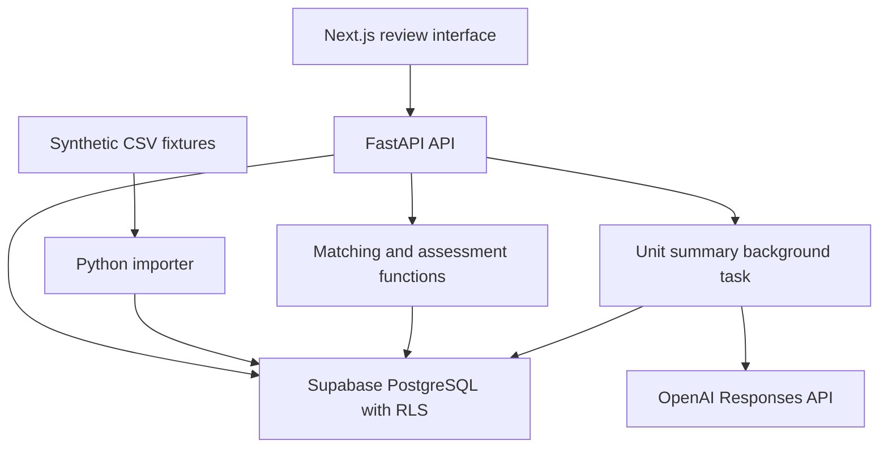

# Recovery Manager Architecture

## 1. Purpose

Recovery Manager helps seller operations teams inspect whether operational evidence addresses financial charges and reimbursement events.

The current implementation imports synthetic CSV records, matches evidence, saves conservative assessments, preserves human reviews and provides an OpenAI summary integration.

It does not establish approved recovery amounts or submit claims.

## 2. System architecture



The browser communicates with FastAPI. Database credentials and the OpenAI API key remain in the backend environment.

## 3. Components

| Component | Responsibility |
| --- | --- |
| `frontend/app/page.js` | Organisation connection, assessment table, evidence inspection, human reviews, AI summary requests and JSON export |
| `backend/recovery/api.py` | Authentication, API endpoints, input validation and background-task scheduling |
| `backend/recovery/db.py` | Restricted database connections and transaction-scoped organisation context |
| `backend/recovery/importer.py` | CSV validation, source-row preservation, hashing and deduplication |
| `backend/recovery/matcher.py` | Organisation-scoped matching and identifier-conflict detection |
| `backend/recovery/decisions.py` | Deterministic assessment and explanation generation |
| `backend/recovery/ai.py` | Evidence summary generation for a unit |
| `backend/tests/test_isolation.py` | Checks that Bravo cannot read or update an Alpha decision |

## 4. Data storage

Application tables live in the PostgreSQL `recovery` schema.

### Records

The `records` table stores:

- Record ID.
- Organisation ID.
- Source kind: fees, receiving, prep, pack or returns.
- Original CSV row as JSON.
- Source row number.
- Content hash.
- Import timestamp.

A unique constraint on organisation, source kind and content hash prevents repeated imports of identical rows.

The content hash supports deduplication. It does not provide an immutable or tamper-evident audit system.

### Decisions

The `decisions` table stores:

- Decision ID.
- Organisation ID.
- Assessment result as JSON.
- Creation timestamp.

The result includes the original charge, matched evidence, assessment, explanation, claim status and available processing metadata.

Reassessment inserts new decision records. The list endpoint displays the latest saved assessment for each report-line identifier.

### Reviews

The `reviews` table stores:

- Review ID.
- Organisation ID.
- Associated decision ID.
- Original decision snapshot.
- Human assessment and reason.
- Reviewer identifier.
- Creation timestamp.

An organisation-scoped foreign key connects reviews to decisions.

Reviews preserve the original assessment. They do not approve claim amounts.

## 5. Organisation isolation

Authentication uses two distinct backend-configured bearer tokens:

- Alpha token maps to `org_demo_alpha`.
- Bravo token maps to `org_demo_bravo`.

The API derives the organisation from the token rather than accepting an organisation supplied by the browser.

Each database transaction sets:

```sql
SELECT set_config('app.org_id', '<authenticated organisation>', true);
```

Every application table has row-level security enabled and forced. Policies restrict reads and writes to rows whose `org_id` matches the transaction context.

The application connects through the restricted `recovery_app` role. The connection helper rejects roles with superuser or row-security bypass privileges.

This is demo authentication. Individual user accounts, token expiry and role management are not implemented.

No evidence-image serving endpoint is implemented. Sample photo paths are displayed as references, not retrieved assets.

## 6. Import data flow

1. Read the provided CSV fixtures.
2. Validate required identifiers and row structure.
3. Preserve source values in JSON.
4. Separate records by organisation.
5. Compute a canonical content hash.
6. Insert records through an organisation-scoped database transaction.
7. Skip identical records already imported.

The importer is a command-line tool. Browser-based financial report uploads are not implemented.

## 7. Matching data flow

For each financial line:

1. Retrieve records within the authenticated organisation.
2. Match the exact `unit_id`.
3. Select evidence sources relevant to the charge type.
4. Compare available related identifiers.
5. Include matched records and identifier conflicts in the assessment input.

### Evidence source mapping

| Charge type | Evidence sources considered |
| --- | --- |
| `inbound_defect_fee` | Prep |
| `lost_inbound` | Receiving and prep |
| `damaged_in_warehouse` | Receiving, prep and returns |
| `fulfilment_fee_weight_tier` | No suitable measurement source in the current adapter |
| `refund_issued_item_not_returned` | Returns |

Pack records are imported but are not used by the current charge-specific matching rules.

A matching unit identifier does not establish evidence sufficiency, responsibility or claim eligibility.

## 8. Assessment logic

Assessment logic runs in Python functions rather than an LLM prompt.

The implementation checks:

- Financial amount and quantity validity.
- Report type.
- Duplicate line identifiers.
- Potential related reimbursement entries.
- Missing evidence.
- Identifier conflicts.
- Evidence timing where relevant.
- Missing measurements, requirements or valuation information.

### Outcomes

| Outcome | Interpretation |
| --- | --- |
| `CONTRADICTS` | Evidence contradicts the charge allegation, subject to remaining eligibility checks |
| `SUPPORTS` | Evidence supports the charge allegation |
| `SILENT` | Available evidence does not address the charge, or a reimbursement event is recorded separately |
| `UNCERTAIN` | Evidence cannot support a defensible conclusion because of missing information or conflicts |

All four outcomes are available for human review. Automatic `SUPPORTS` reasoning is not implemented.

The current synthetic sample run produces only `SILENT` and `UNCERTAIN`.

### Conservative decision examples

- Weight-tier fees remain `SILENT` without measurements and an applicable schedule.
- Generic inbound defect fees remain `UNCERTAIN` without the specific alleged defect and authoritative requirements.
- Receiving or prep evidence alone does not prove channel receipt or subsequent loss.
- Warehouse damage requires custody and responsibility evidence.
- Return evidence requires identity, timing and quantity checks.
- Potential reimbursement matches require reconciliation before a claim balance can be established.

No approved recoverable amount is calculated.

## 9. OpenAI usage

The AI integration generates an explanatory summary. It does not determine the original assessment.

### Summary flow

1. Authenticate the request and verify access to the selected decision.
2. Mark summary processing as `pending`.
3. Schedule a FastAPI background task.
4. Retrieve available assessments for the same unit.
5. Collect and deduplicate matched evidence.
6. Make one OpenAI request containing the unit's available checks.
7. Save the summary and processing status.

The default configured model is `gpt-4.1-mini`, accessed through the OpenAI Responses API.

The request uses `store=False`, a timeout and no SDK retries.

Instructions require the model to use supplied records, reference identifiers and avoid inventing policies, measurements or image observations. These instructions do not guarantee factual accuracy; users must check summaries against source records.

One request is made per unit-summary action. Repeated actions can generate additional calls.

The direct OpenAI connection test succeeded. End-to-end summary generation in the interface remains to be verified.

## 10. Failure handling

Imported evidence and original decisions remain available if AI generation fails.

Summary processing remains `pending`, and an error message indicates that generation was not completed.

Background tasks run inside the API process. They are not durable jobs. A server restart can interrupt processing and leave a summary pending.

The interface allows evidence inspection and human review independently of summary completion.

## 11. Human review flow

1. The operator selects a saved decision.
2. The API returns the decision and its review history.
3. The operator selects an assessment and supplies a reason.
4. The API validates the input.
5. A review row stores the original decision snapshot and human assessment.
6. The interface refreshes the review history.

Reviews are attached to a specific decision version. Reassessment creates a new version and does not automatically transfer previous reviews.

The reviewer identifier represents an organisation demo-token holder rather than a verified individual identity.

## 12. API endpoints

| Method | Endpoint | Purpose |
| --- | --- | --- |
| GET | `/health` | Service health |
| GET | `/me` | Authenticated organisation |
| GET | `/decisions` | Latest assessments by report line |
| GET | `/decisions/{decision_id}` | Decision details and reviews |
| POST | `/assessments` | Run organisation assessments |
| POST | `/decisions/{decision_id}/reviews` | Save a human review |
| POST | `/decisions/{decision_id}/ai-summary` | Request a unit evidence summary |

Decision access is subject to organisation row-level security.

## 13. Important engineering decisions

### PostgreSQL row-level security

Organisation isolation is enforced in the database as well as through API authentication.

### Deterministic assessments

Explicit Python rules make assessment explanations traceable and keep model output from approving financial claims.

### Original source preservation

Imported rows remain available for inspection rather than being replaced with generated summaries.

### First-class uncertainty

Missing or conflicting information produces an explicit uncertain outcome instead of an unsupported pass.

### Review preservation

Human disagreements are stored as additional records with reasons and original decision snapshots.

### No image claims

Fixture photo paths are not treated as verified visual evidence.

### No policy inference from dummy data

Synthetic requirement flags and fee values are not authoritative channel rules. Authoritative policy retrieval is not integrated.

### CSV adapter boundary

The implementation follows the supplied sample CSV formats. Official cross-manager contract compatibility has not been verified.

## 14. Verification

Observed checks:

- Database connection uses `recovery_app`.
- Alpha can read its own test decision.
- Bravo cannot read or update Alpha's test decision.
- All 276 sample rows were imported.
- The interface displays Alpha's 40 financial lines.
- Human review saves without replacing the original assessment.
- A direct OpenAI request succeeded.

Isolation testing currently covers decision access. It does not establish complete coverage of every table or object-storage operation.

### Sample output counts

| Organisation | Financial lines | SILENT | UNCERTAIN |
| --- | ---: | ---: | ---: |
| Alpha | 40 | 26 | 14 |
| Bravo | 21 | 17 | 4 |
| Total | 61 | 43 | 18 |

These counts are not accuracy metrics.

The independent 50-unit, two-labeller evaluation has not been completed. Claim precision, false positives, false negatives and labeller agreement are not established.

## 15. Deployment and configuration

Local development uses:

- Next.js: `http://localhost:3000`
- FastAPI: `http://localhost:8000`
- Supabase: hosted PostgreSQL

Backend environment variables:

- `DATABASE_URL`
- `ALPHA_TOKEN`
- `BRAVO_TOKEN`
- `FRONTEND_ORIGIN`
- `OPENAI_API_KEY`
- `OPENAI_MODEL`

The frontend supports `NEXT_PUBLIC_API_URL` for the API address.

For a hosted deployment, configure the public backend URL, frontend origin and private backend secrets in the hosting provider. Never expose database credentials or the OpenAI key in frontend variables.

Database provisioning is currently manual.

## 16. Current limitations and future work

- Verify official evidence-contract compatibility.
- Add authoritative channel policy retrieval.
- Implement complete evidence-supported claim reasoning.
- Implement automatic `SUPPORTS` cases.
- Reconcile duplicates and reimbursements reliably.
- Establish supported claim amounts and exportable claim packets.
- Add authenticated evidence storage and retrieval.
- Replace demo tokens with individual authentication.
- Add durable background jobs.
- Expand isolation and reasoning tests.
- Complete the independent evaluation.
- Add report-upload workflows.

These items are future work, not completed capabilities.