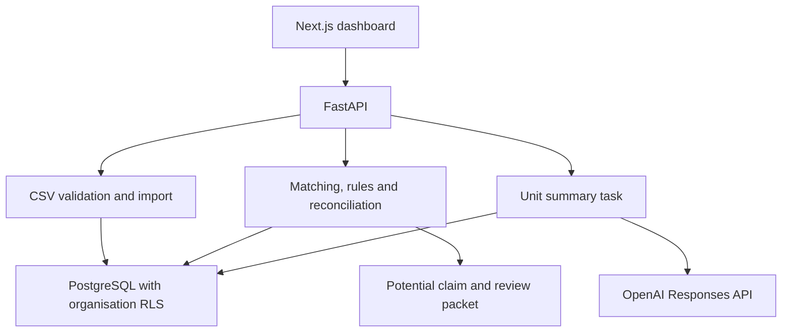

# Recovery Manager Architecture

## 1. Purpose

Recovery Manager matches financial report lines against structured operational evidence, produces conservative assessments, reconciles documented reimbursements and prepares conditional recovery review packets.

The system preserves original assessments and human reviews. OpenAI provides explanatory summaries, while Python rules determine evidence assessments and potential amounts.

It does not file claims or approve recoverable amounts.

## 2. System architecture



The browser communicates with FastAPI. Database credentials and the OpenAI API key remain in the backend environment.

Command-line scripts also import reference records, seed synthetic development scenarios and run assessments.

## 3. Components

| Component | Responsibility |
| --- | --- |
| `frontend/app/page.js` | Organisation connection, CSV upload, assessment display, evidence inspection, AI summaries, human reviews and exports |
| `api.py` | Authentication, request handling, upload limits and background-task scheduling |
| `db.py` | Restricted database connections and transaction-scoped organisation context |
| `importer.py` | Import of organiser-provided reference CSVs |
| `report_upload.py` | Financial CSV validation, organisation enforcement and repeat detection |
| `matcher.py` | Evidence retrieval and identifier-conflict detection |
| `decisions.py` | Assessment orchestration, reconciliation gates and decision persistence |
| `prep_rules.py` | Specific packaging-allegation reasoning |
| `shipment_rules.py` | Linked final inspection, dispatch timing and documented continuity |
| `return_rules.py` | Return-event identity, recipient, quantity and timing checks |
| `reconciliation.py` | Duplicate detection and explicitly linked reimbursement calculations |
| `claims.py` | Conditional potential amount calculation and blocking checks |
| `packets.py` | Recovery review packet assembly |
| `policies.py` | Policy-source retrieval attempts and unverified policy context |
| `ai.py` | One model request containing the unit’s available assessments and evidence |
| `evaluation.py` | Evaluation preparation and comparison of independently supplied labels |
| Seed scripts | Clearly labelled synthetic development scenarios |
| Tests | Rule, validation, AI-failure and database-isolation checks |

## 4. Data storage

Application tables reside in the PostgreSQL `recovery` schema.

### Records

The `records` table contains:

| Column | Purpose |
| --- | --- |
| `id` | Internal UUID |
| `org_id` | Organisation ownership |
| `kind` | Fees, receiving, prep, pack or returns |
| `raw` | Imported fields stored as JSON |
| `row_number` | Source row number |
| `content_hash` | Hash of canonical imported JSON |
| `imported_at` | Import timestamp |

A unique constraint on `(org_id, kind, content_hash)` skips identical imported records.

Content hashes support repeat detection. They do not provide immutability, evidence authentication or a tamper-evident audit system.

### Decisions

The `decisions` table contains:

- Decision UUID.
- Organisation ownership.
- Assessment result JSON.
- Creation timestamp.

The result stores the report row, matched evidence, assessment, explanation, evidence citations, reconciliation, flags and rule version.

AI processing metadata is added to the result without replacing the original assessment.

Reassessment inserts new decision versions. The list endpoint returns the latest version for each report-line identifier.

### Reviews

The `reviews` table contains:

- Review UUID.
- Organisation ownership.
- Associated decision UUID.
- Original decision snapshot.
- Human assessment, reason and reviewer identifier within review JSON.
- Creation timestamp.

An organisation-scoped foreign key connects reviews to decisions.

Reviews belong to a specific decision version and do not automatically transfer to later versions.

Potential claims and review packets are assembled from saved decisions. They are not separate persisted claim records.

## 5. Organisation isolation

Two backend-configured bearer tokens map to:

- `org_demo_alpha`
- `org_demo_bravo`

The API derives ownership from authentication. The browser cannot select another organisation through uploaded data.

Each database transaction sets the organisation context using a parameterised call equivalent to:

```sql
SELECT set_config('app.org_id', '<authenticated organisation>', true);
```

Every application table has RLS enabled and forced. Policies scope rows to the active organisation context.

The application uses the restricted `recovery_app` database role. Connections using superuser or RLS-bypass roles are rejected.

Organisation-scoped foreign keys prevent attaching a review to another organisation’s decision.

Authentication remains a demonstration mechanism. Individual accounts, token expiry and user role management are not implemented.

No image-serving endpoint or object-storage workflow is implemented.

## 6. Import workflows

### Reference-data import

The command-line importer reads the organiser’s CSV fixtures, separates organisations, preserves source fields, hashes canonical records and inserts through organisation-scoped transactions.

The supplied reference dataset contains 276 synthetic rows.

### Dashboard financial upload

The browser sends CSV bytes directly to `POST /reports/upload` with a bearer token and `Content-Type: text/csv`.

The API bounds the incoming body to 2 MB. Parsing and database import run in a worker thread so synchronous database work does not block the async request loop.

The validator checks the whole report before opening a write transaction.

Required columns:

```text
line_id
report_type
unit_id
charge_type
quantity
amount_usd
posted_date
```

Validation covers:

- UTF-8 encoding and CSV structure.
- Required and duplicate headers.
- Required field values.
- Supported report and charge types.
- Positive integer quantities.
- Nonnegative amounts with at most two decimal places.
- Valid ISO dates.
- USD currency.
- Duplicate line IDs within the file.
- Maximum 5,000 report rows.
- Organisation ownership.

A supplied `org_id` must match authentication. The server assigns the authenticated organisation to every imported row.

Unspecified dataset provenance is labelled `uploaded-unverified`; it is not treated as verified evidence.

Invalid reports return row-level errors without importing rows. Validation messages are capped at 50 errors.

Valid records are inserted in one database transaction. Exact repeats are skipped using the content-hash constraint.

Changed records with an existing line ID remain separate source records and require duplicate review.

### Upload and assessment sequence

1. Validate and import the report.
2. Commit the source records.
3. Return import and repeat counts.
4. The frontend requests `/assessments`.
5. The frontend retrieves refreshed decisions.

Import and assessment are separate operations. An assessment failure does not roll back an already saved report.

Operational evidence is imported separately. Dashboard uploads currently handle financial reports only.

## 7. Evidence retrieval and matching

The matcher retrieves records visible under organisation RLS, matches exact `unit_id` values and selects source kinds relevant to each charge.

| Charge type | Evidence sources considered |
| --- | --- |
| `inbound_defect_fee` | Prep |
| `lost_inbound` | Receiving and prep |
| `damaged_in_warehouse` | Receiving, prep and returns |
| `fulfilment_fee_weight_tier` | No suitable measurement source in the current adapter |
| `refund_issued_item_not_returned` | Returns |

Pack records are stored but do not participate in current charge-specific reasoning.

When both values are available, related identifiers are compared for SKU, order, FNSKU and shipment conflicts.

Each evidence match includes its record ID, source manager, timestamp, identifier conflicts and imported fields.

A unit match is a retrieval step, not proof of evidence sufficiency or financial eligibility.

## 8. Assessment orchestration

`decisions.py` coordinates the rules:

1. Validate financial values and report type.
2. Identify reimbursement entries.
3. Reconcile duplicate and reimbursement references.
4. Stop claim progression when reconciliation blocks it.
5. Check identifier conflicts.
6. Handle missing or unsuitable evidence.
7. Apply supported charge-specific rules.
8. Save an assessment, explanation and supporting evidence IDs.

The four outcomes are:

| Outcome | Interpretation |
| --- | --- |
| `CONTRADICTS` | Structured evidence contradicts the allegation |
| `SUPPORTS` | Structured evidence supports the allegation |
| `SILENT` | Available evidence does not address the allegation |
| `UNCERTAIN` | Missing or conflicting information prevents a defensible conclusion |

Reimbursement entries are recorded as `SILENT` with `REIMBURSEMENT_RECORDED` claim status.

A fully reimbursed charge receives `ALREADY_REIMBURSED`. The current orchestration leaves its allegation assessment uncertain rather than separately assessing evidence correctness after that reconciliation gate.

## 9. Charge-specific rules

### Packaging allegations

The supported specific allegation is `polybag_not_sealed`.

Same-event reasoning checks explicit event linkage, identifiers, observation timing and inspection state.

Dispatch-scope reasoning checks:

- An explicitly referenced final prep record.
- Matching organisation, unit, SKU, FNSKU and shipment.
- Final-inspection status.
- Inspection before or at dispatch.
- Dispatch no later than the report posting date.
- Explicitly documented condition preservation until dispatch.

A sealed observation can contradict the allegation. An unsealed observation can support it.

Conflicting observations, pending reviews, missing identifiers and invalid timing produce uncertainty.

Documented continuity is a source assertion. It is not independently authenticated chain-of-custody proof.

### Return receipts

Return reasoning requires a matching return event, organisation, unit, order and item identity.

It also checks:

- Confirmed receipt.
- Receipt by the specified required recipient.
- Completed review state.
- Valid timezone-aware receipt and capture timestamps.
- Receipt by the documented deadline.
- Capture at or after receipt.
- Returned quantity equal to charged quantity.

Partial quantity, late receipt and the wrong recipient remain uncertain. A different return event is silent on the charge.

The rule does not infer non-return from an absence of records.

Deadlines and recipient requirements are development-adapter fields. Their presence does not verify authoritative channel policy.

### Other charge types

Weight-tier assessment requires unavailable measurement and fee-schedule information.

Receiving and prep records alone do not prove channel loss. Condition records alone do not establish custody or responsibility for warehouse damage.

These scenarios remain silent or uncertain as appropriate.

## 10. Duplicate and reimbursement reconciliation

Reconciliation is scoped to the organisation.

It checks:

- Repeated charge-line identifiers.
- Repeated source-transaction identifiers.
- Duplicate linked payment lines.
- Duplicate payment-transaction references.
- Explicit payment allocation.
- Consistent unit, charge type and currency.
- Valid payment amounts.

Unallocated possible reimbursements block claim progression for review.

Distinct, valid reimbursements explicitly linked to a charge are summed:

- Partial reimbursement produces a remaining reported balance.
- Full reimbursement produces a zero reported balance and blocks a new potential claim.
- Over-reimbursement requires review.

The balance is arithmetic over imported entries. It is not an approved recovery amount, and the completeness of the imported financial history is not established.

## 11. Potential claims and review packets

`claims.py` calculates conditional potential amounts only for supported fee-report scenarios with contradicting cited evidence.

Calculation is blocked by duplicate or review flags, missing evidence citations, inconsistent reconciliation, unsupported currency or valuation, and full reimbursement.

The amount basis is either:

- The reported fee where no linked reimbursement was found; or
- The reported fee minus validated linked reimbursements.

No linked reimbursement does not prove that no payment exists elsewhere.

Inventory-loss recovery requires separate valuation and is not calculated using the current report amount.

Synthetic development cases are labelled `SYNTHETIC_POTENTIAL_CLAIM`.

Approved amounts remain unset, and submission readiness remains false.

`packets.py` assembles:

- Decision and report identifiers.
- Original report row.
- Assessment and explanation.
- Cited structured evidence.
- Reimbursement reconciliation.
- Conditional potential claim.
- Human review history.
- Policy context.
- Outstanding authenticity, eligibility and financial checks.

Packet export does not file a claim.

## 12. Policy and contract boundaries

`policies.py` attempts retrieval from a configured official policy source.

Tracking can include source URL, retrieval status, retrieval timestamp, retrieved content, content hash and candidate passages.

The current Amazon bagging-source retrieval remains `PENDING_SOURCE_REVIEW`. Applicable marketplace, event-date rules and dispute eligibility remain unverified.

A retrieved passage would still require applicability review. A source URL alone does not establish compliance or claim eligibility.

Policy snapshots are local files. Their availability in a deployment depends on packaging and filesystem behaviour.

The implementation uses organiser CSV shapes and explicitly labelled development fields. Compatibility with the organiser’s official evidence contract remains unverified.

## 13. OpenAI summary workflow

OpenAI generates narrative reviewer aids. It does not determine deterministic assessments or approved amounts.

1. Authenticate access to the selected decision.
2. Schedule a background summary task.
3. Retrieve the unit’s latest assessments.
4. Include the selected version if it is an older decision.
5. Persist pending status before calling the model.
6. Deduplicate evidence by manager and record ID.
7. Send one request containing the unit’s report lines, assessments, explanations, reconciliation and evidence.
8. Save summary status and text to the selected decision versions.

The model is configured through `OPENAI_MODEL`. Requests use the Responses API with `store=False`, a 20-second timeout and no SDK retries.

Instructions require accurate charge names, supplied identifiers, clear synthetic provenance and no invented policies or image observations.

End-to-end generation has been demonstrated in the interface.

Repeated requests can generate additional calls. There is no persistent unit-level job deduplication or durable queue.

## 14. Failure handling

Model timeout, provider error, empty output or incomplete output leaves the original records and assessments available.

AI state remains pending with a generic retry message. Provider exception details are not returned to users.

Background work runs inside the API process. Process interruption can leave work pending.

The frontend polls decision details after requesting a summary. Evidence inspection and human review do not depend on summary success.

CSV validation errors return structured row messages. If import succeeds but assessment or refresh fails, the frontend reports that the report remains saved and can be reassessed.

## 15. Human review and frontend state

Human review stores an original decision snapshot, new assessment, required reason and reviewer identifier.

It does not overwrite the original assessment or approve a claim amount.

Reviewers are identified as organisation demo-token holders rather than verified individuals.

The frontend uses a request-version reference to ignore responses from earlier selections or organisation connections.

Changing the token clears connected records, selected decisions and upload state.

This frontend guard prevents stale display updates. Database isolation is enforced separately through authentication and RLS.

## 16. API surface

| Method | Endpoint | Purpose |
| --- | --- | --- |
| GET | `/health` | Service health |
| GET | `/me` | Authenticated organisation |
| POST | `/reports/upload` | Validate and import financial CSV bytes |
| GET | `/decisions` | Latest saved assessments by report line |
| GET | `/decisions/{decision_id}` | Decision details and reviews |
| POST | `/assessments` | Assess organisation records |
| POST | `/decisions/{decision_id}/reviews` | Preserve a human review |
| POST | `/decisions/{decision_id}/ai-summary` | Request a unit summary |
| GET | `/decisions/{decision_id}/review-packet` | Assemble a recovery review packet |

All endpoints except health require organisation authentication.

Decision identifiers are UUIDs. Cross-organisation or unavailable decisions return not found.

## 17. Verification

Observed passing regression suites:

| Suite | Tests |
| --- | ---: |
| Prep rules | 10 |
| Shipment rules | 12 |
| Return rules | 16 |
| Reconciliation | 15 |
| Potential claims | 11 |
| AI processing | 5 |
| CSV validation | 18 |
| Total | 87 |

Database checks separately verified:

- Restricted application role.
- Enabled and forced RLS on all three tables.
- Own-organisation reads and inserts.
- Cross-organisation read and insert rejection.
- Decision update and ownership-change restrictions.
- Organisation-scoped review relationships.
- Zero visible rows and denied inserts without organisation context.

Test data was rolled back after isolation checks.

A cross-organisation review-packet request returned 404.

Dashboard checks demonstrated import, exact-repeat skipping, conflicting-organisation rejection, human review, AI generation, reconciliation and packet export.

These checks establish tested behaviours. They are not independent claim-accuracy measurements.

The evaluation runner exists, but evaluation on 50 unseen units labelled by two humans remains incomplete. Precision, false positives, false negatives and labeller agreement are not established.

## 18. Deployment and configuration

Local services:

- Frontend: `http://localhost:3000`
- API: `http://localhost:8000`
- Database: hosted Supabase PostgreSQL

Frontend deployment:

https://cube26-rcy-0266-mdmoghnishah.vercel.app/

Backend variables:

```text
DATABASE_URL
ALPHA_TOKEN
BRAVO_TOKEN
FRONTEND_ORIGIN
OPENAI_API_KEY
OPENAI_MODEL
```

Frontend variable:

```text
NEXT_PUBLIC_API_URL
```

The backend Vercel configuration identifies `recovery.api:app` as the FastAPI entrypoint.

Production origins and API addresses must be configured explicitly. Database credentials and model keys must remain private backend variables.

Database provisioning is manual. Local verification does not establish equivalent behaviour in every hosting environment.

## 19. Engineering decisions and limitations

- Database RLS enforces organisation separation independently of frontend state.
- Explicit Python rules keep financial reasoning inspectable.
- Source records and human disagreements are preserved.
- Uncertainty is a first-class outcome.
- Decimal arithmetic is used for monetary checks.
- Model calls are grouped by unit-summary action.
- Content hashes identify exact repeats without claiming immutability.
- Placeholder image references are not treated as verified visual evidence.
- Synthetic records are development examples, not labelled ground truth.
- Real policy applicability and official contract compatibility remain unverified.
- Conditional amounts do not become approved claims.
- Current upload support is CSV only.
- Pack-specific reasoning and broader loss/damage valuation remain incomplete.
- Authentication and background processing remain prototype-level.
- Independent evaluation remains pending.